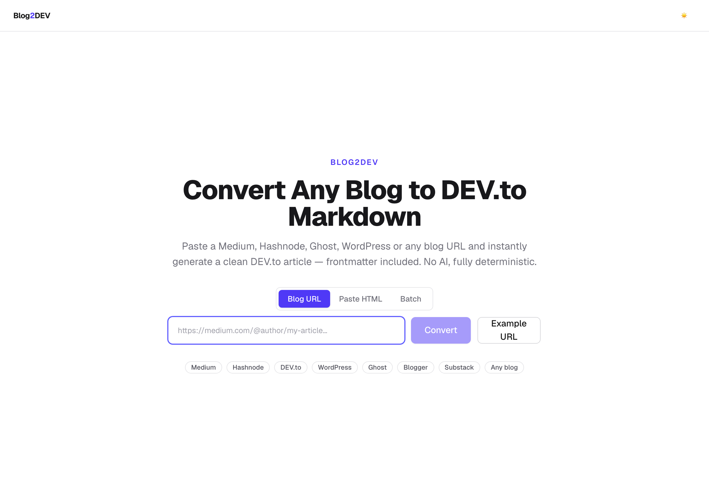
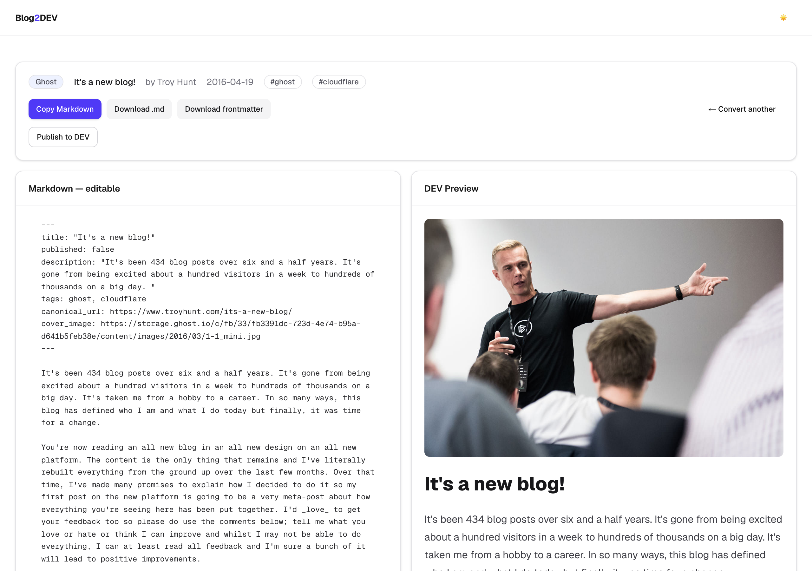
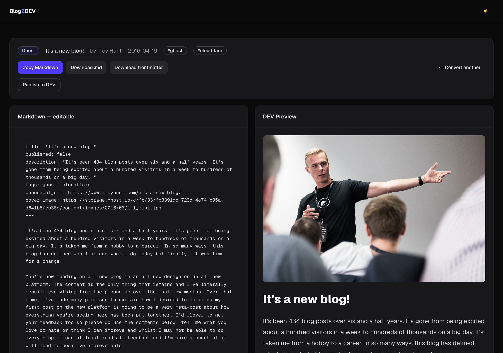
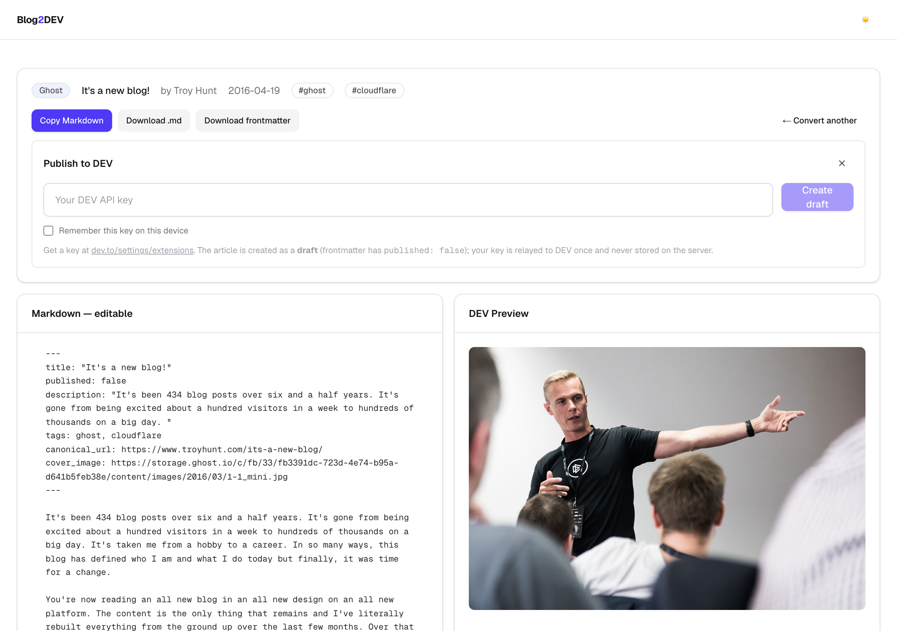
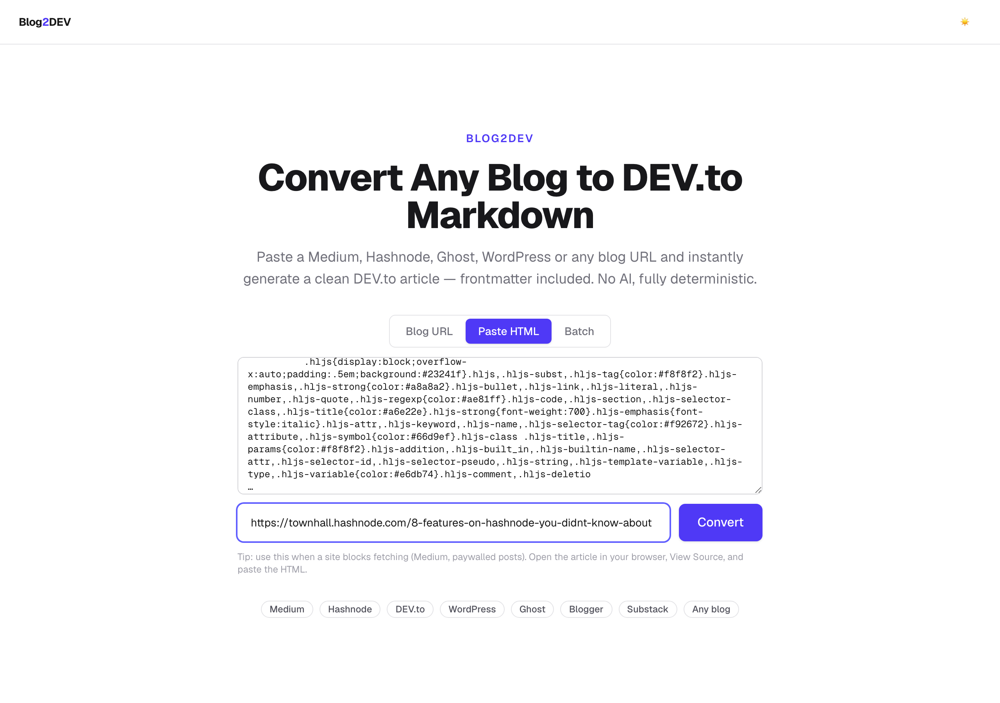
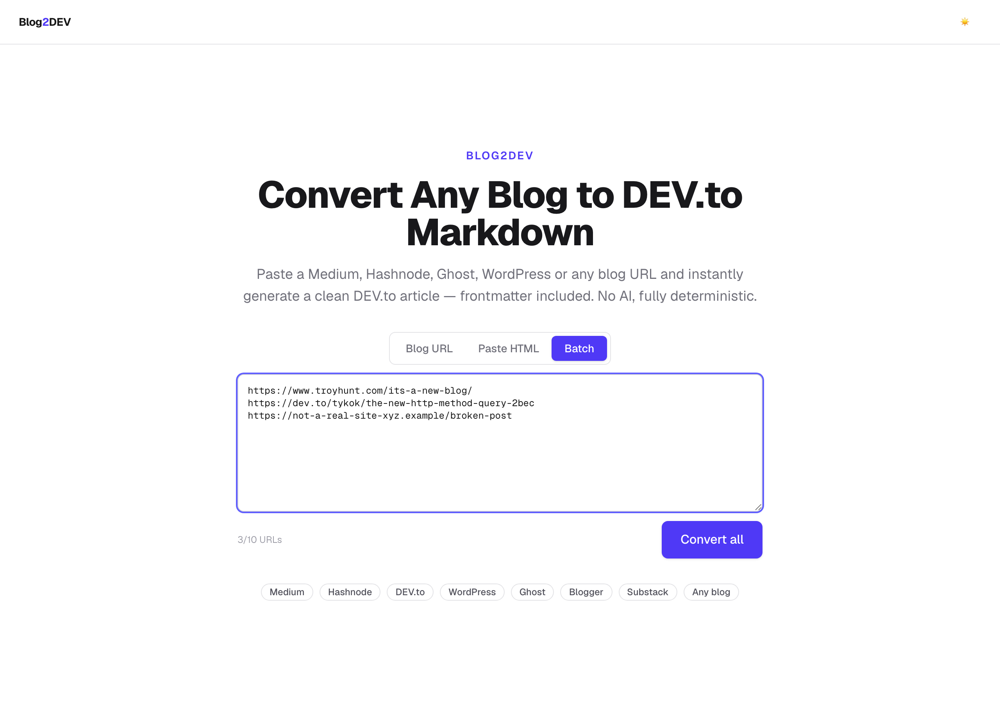
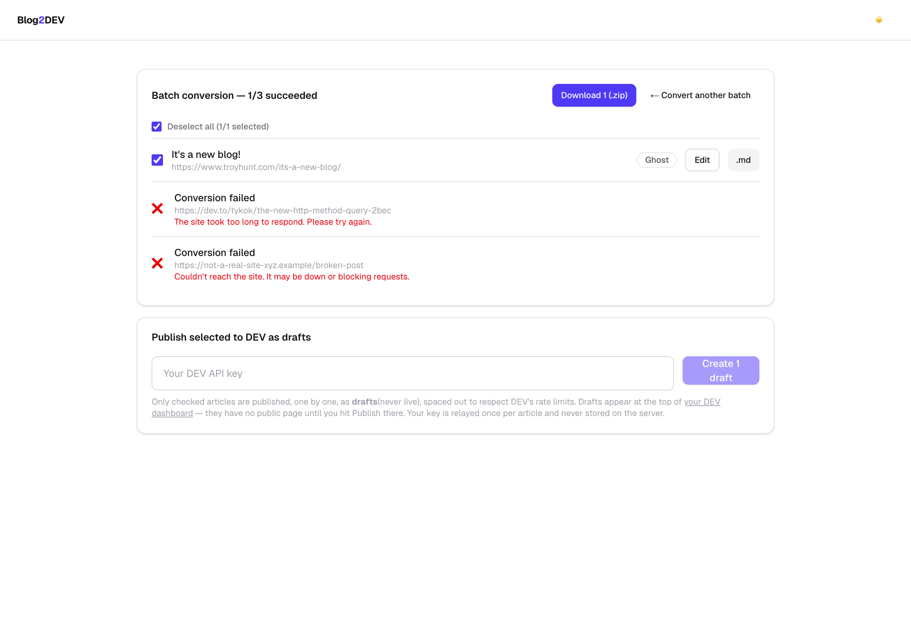
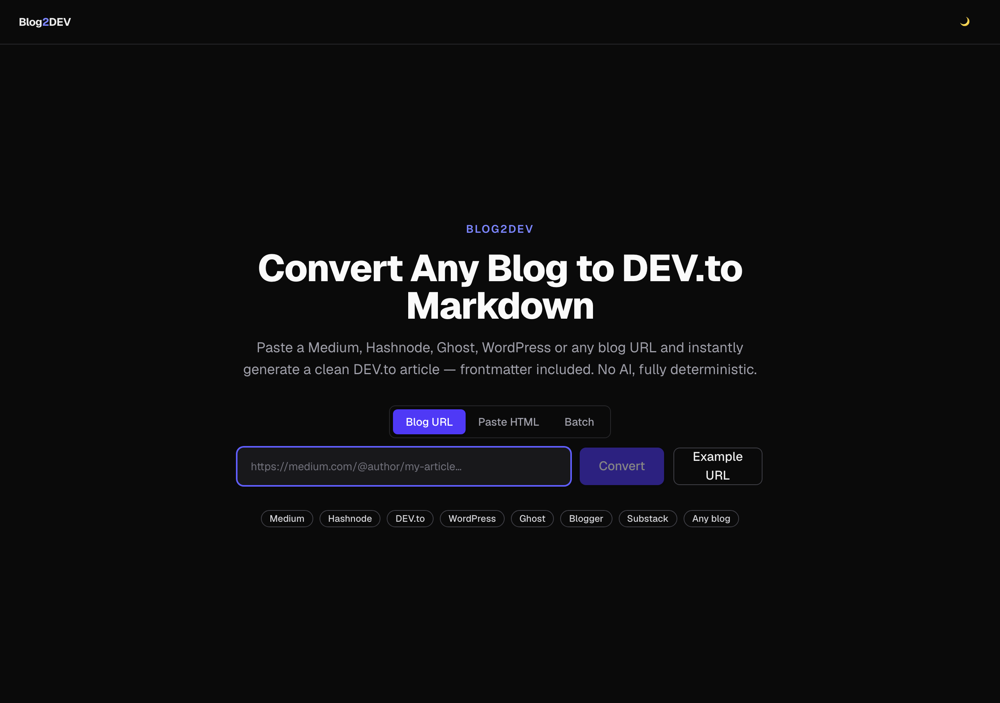

# Blog2DEV — Universal Blog → DEV.to Converter

Paste any blog URL and get a clean, **DEV.to-ready Markdown article** with frontmatter — ready to preview, edit, download, or publish straight to DEV.to as a draft.

Everything is **deterministic**: HTML parsing (Cheerio), Markdown conversion (Turndown), and platform-specific cleanup rules. **No AI. No database.**



---

## Table of contents

- [What it does](#what-it-does)
- [Supported platforms](#supported-platforms)
- [Quick start](#quick-start)
- [Features & how to use them](#features--how-to-use-them)
  - [1. Convert a single blog URL](#1-convert-a-single-blog-url)
  - [2. Write a post from scratch](#2-write-a-post-from-scratch)
  - [3. Edit the output live](#3-edit-the-output-live)
  - [4. Fix it for DEV (one button)](#4-fix-it-for-dev-one-button)
  - [5. Copy & download](#5-copy--download)
  - [6. Publish to DEV.to](#6-publish-to-devto)
  - [7. Paste HTML (for sites that block fetching)](#7-paste-html-for-sites-that-block-fetching)
  - [8. Batch mode — up to 10 posts at once](#8-batch-mode--up-to-10-posts-at-once)
  - [9. Dark / light mode](#9-dark--light-mode)
  - [10. Refresh-safe session](#10-refresh-safe-session)
  - [11. Schedule posts to publish later](#11-schedule-posts-to-publish-later)
  - [12. Built-in blog series](#12-built-in-blog-series)
- [How the conversion pipeline works](#how-the-conversion-pipeline-works)
- [API reference](#api-reference)
- [Project structure](#project-structure)
- [Development](#development)
- [FAQ / notes](#faq--notes)
- [Out of scope](#out-of-scope)

---

## What it does

1. You paste a blog URL (or raw HTML, or a list of up to 10 URLs) — **or write
   the post yourself** in the app.
2. Blog2DEV fetches the page, detects the platform, extracts the article, strips all the chrome (nav, ads, share buttons, newsletter forms, comments…), and converts it to clean GitHub-flavored Markdown.
3. It generates DEV.to frontmatter (title, tags, canonical URL, cover image) and shows a **live split preview**.
4. You edit if needed, then **copy**, **download** (`article.md` / `.zip`), or **publish to DEV.to as a draft** — with one click.

---

## Supported platforms

| Platform | Detection | Notes |
| --- | --- | --- |
| **Medium** | host + fingerprints | Blocks server-side fetching — use [Paste HTML](#5-paste-html-for-sites-that-block-fetching) |
| **Hashnode** | host, `cdn.hashnode.com` assets, `__NEXT_DATA__` | Works on custom domains (e.g. `blog.yoursite.com`) |
| **DEV.to** | host | Re-import an existing DEV article; reuses its tags |
| **WordPress** | `meta[generator]`, `wp-content` paths | Common themes supported |
| **Ghost** | `meta[generator]`, `.gh-content` | Strips membership/subscribe CTAs |
| **Blogger** | host, `meta[generator]` | Handles `<script type="text/template">` bodies |
| **Substack** | host, CDN markers | Public posts; paywalled content → use Paste HTML |
| **Any HTML blog** | fallback | Scores blocks by text density vs. link density |

---

## Quick start

```bash
npm install
npm run dev
```

Open **http://localhost:3000**, paste a blog URL, and hit **Convert**.

```bash
npm run build && npm start   # production build
npm test                     # Vitest: unit + extractor regression tests
npm run lint                 # ESLint
npm run screenshots          # regenerate docs screenshots (needs app on :3799)
```

---

## Features & how to use them

### 1. Convert a single blog URL

On the **Blog URL** tab, paste a link and click **Convert** (or **Example URL** to try a sample). Blog2DEV fetches the page, auto-detects the platform, and produces the article.

The result view opens with a metadata bar (platform badge, title, author, date, tags), a toolbar, and the editor/preview split:



**What you get:** headings, bold/italic, blockquotes, ordered & unordered lists, links, tables, fenced code blocks (with language detection), inline code, images (with alt text), and horizontal rules — all cleaned and normalized.

### 2. Write a post from scratch

You don't need a source URL. On the **Write** tab, type or paste plain text or
markdown and Blog2DEV turns it into a DEV.to-ready article.

Everything DEV needs is inferred from what you wrote:

| Field | How it's determined |
| --- | --- |
| **Title** | A leading `# heading`, else a short unpunctuated first line. Removed from the body so it isn't duplicated — DEV renders the frontmatter title as the page H1. |
| **Description** | The first real sentence of prose, skipping headings, lists and code. Trimmed to DEV's 155-character limit. |
| **Tags** | Up to 4, weighted by where words appear — code fence languages and title words rank highest, body prose lowest. Filler ("getting started", "guide") and measurements ("2gb") are filtered out. |
| **Heading levels** | Any `#` left in the body is shifted down (`#` → `##`, `##` → `###`, …) so the frontmatter title is the only H1. DEV's editor warns about competing H1s; this avoids the warning. `#` comments inside code fences are untouched. |

Type this:

````markdown
# Why I Switched to DuckDB

I had a 2GB CSV and a question about it. Postgres felt like too much
ceremony for one query.

```sql
SELECT country, count(*) FROM 'data.csv' GROUP BY ALL;
```
````

...and get this frontmatter:

```yaml
---
title: "Why I Switched to DuckDB"
published: false
description: "I had a 2GB CSV and a question about it."
tags: sql, duckdb
---
```

Want to set them yourself? **Set title & tags** reveals optional fields that
override anything inferred. Pasting text that already has frontmatter reuses
it rather than treating it as body content.

Markdown passes through as-is — headings, code fences, lists, tables — and
DEV renders ```` ```mermaid ```` diagrams natively. From there it behaves like
any converted post: edit it live, download it, publish it, or schedule it.

---

### 3. Edit the output live

The left pane (**"Markdown — editable"**) is a full editor. As you type:

- the right pane (**DEV Preview**) re-renders instantly, exactly as DEV.to would show it;
- editing the frontmatter `title:` or `cover_image:` updates the preview heading and cover;
- an **"edited"** badge appears, and a **Revert edits** button restores the original conversion.

Everything you do here flows into copy, download, and publish — so you can fix up an article before it ever leaves the page.



### 4. Fix it for DEV (one button)

DEV.to rejects articles whose frontmatter it can't parse — usually with
*"Title can't be blank"* or *"found unexpected end of stream while scanning a
quoted scalar"*. Both mean the YAML broke, most often from a hand edit.

The toolbar shows **Fix N issues** whenever something would be rejected, and
**✓ Valid for DEV** when nothing would. One click repairs:

| Problem | Repair |
| --- | --- |
| Unterminated quote (`title: "My Post`) | Closes it |
| Inner or smart quotes (`"`, `"`) | Escapes / straightens them |
| Missing title | Takes it from the first heading, else `Untitled` |
| `published: "true"` | Emits a bare boolean |
| More than 4 tags, or `Machine Learning` | Caps at 4, lowercases, strips punctuation |
| Description over 155 chars | Trims it |
| Body `#` headings | Demotes them (`#` → `##`) so only the title is an H1 |

It repairs **syntax only** — the article's words are never touched, and running
it twice changes nothing further. Unrecognized frontmatter keys are preserved.

The same repair runs automatically inside **Publish to DEV** and the scheduler,
so a queued post can't fail unattended at 9am for a stray quote.

---

### 5. Copy & download

From the toolbar:

- **Copy Markdown** — full document (frontmatter + body) to clipboard.
- **Download .md** — saves `article.md`.
- **Download frontmatter** — just the frontmatter block.

The generated frontmatter looks like:

```yaml
---
title: "My Article"
published: false
description: "A short summary pulled from the post…"
tags: javascript, react, webdev
canonical_url: https://original-site.com/my-article
cover_image: https://original-site.com/cover.png
---
```

`published: false` means anything you publish lands as a **draft**, never a live post. Tags are normalized to DEV rules (max 4, lowercase, alphanumeric).

### 6. Publish to DEV.to

Click **Publish to DEV** to expand the publish panel:



1. Get an API key from [dev.to/settings/extensions](https://dev.to/settings/extensions).
2. Paste it in and click **Create draft** (optionally tick "Remember this key on this device").
3. The article is created on DEV.to **as a draft**, and you get a link to **your DEV dashboard** where the draft is waiting.

#### Publish live, skipping the draft

The toolbar offers both choices up front:

| Button | Result |
| --- | --- |
| **Save as draft** | Creates a draft on DEV (`published: false`) — review and publish there |
| **Publish live** | Goes public on DEV immediately (`published: true`) |

Because going live is public and immediate, it takes a confirmation click
before anything is sent. Batch mode has the same option — a **Publish live
immediately** checkbox that applies to every selected article.

The same choice exists for scheduled posts — see
[Schedule posts to publish later](#11-schedule-posts-to-publish-later).

> **Why the dashboard link?** DEV.to drafts have no public page until you hit Publish there — their provisional URL (`…-temp-slug-######`) 404s for anyone who isn't the signed-in author. So Blog2DEV sends you to your dashboard, where the draft always appears at the top.

**Re-publishing updates, it doesn't duplicate.** After a successful publish, Blog2DEV remembers the DEV article ID in your browser (keyed by canonical URL). Publishing the same post again **updates** that existing draft instead of creating a copy. If you deleted the draft on DEV, it detects that and cleanly creates a fresh one.

**Your key is never stored server-side** — it's relayed to DEV once per request and never logged.

### 7. Paste HTML (for sites that block fetching)

Some sites (notably **Medium**, and paywalled **Substack** posts) block automated fetching. Use the **Paste HTML** tab instead:



1. Open the article in your browser → **View Source** → copy the whole HTML.
2. Paste it into the box.
3. Optionally add the **original URL** (used for the canonical link and to resolve relative image paths — if you skip it, Blog2DEV reads the canonical URL embedded in the HTML).
4. Click **Convert**.

The full pipeline runs on the pasted HTML exactly as it would on a fetched page.

### 8. Batch mode — up to 10 posts at once

The **Batch** tab converts many URLs in one go — paste up to **10 URLs, one per line**:



A live counter shows how many URLs you've entered and flags if you exceed 10. Click **Convert all** — every URL converts **in parallel**, and you get a results list:



For each row:

- ✅ / ❌ status, with a specific error message for any failure (one bad URL never sinks the rest);
- a **checkbox** (all successful conversions start selected) — checkboxes control what gets zipped and published;
- an **Edit** button that opens the full editor for that article (your edits are saved back into the batch);
- a **.md** button to download that single article.

Then, for the **selected** articles:

- **Download N (.zip)** — bundles the selected articles as individual `.md` files (named by slugified title, with collision handling).
- **Create N drafts** — publishes the selected articles to DEV.to sequentially (spaced out to respect DEV's rate limits), with per-row progress and dashboard links. Same safety rules as single publish: always drafts, key never stored.

### 9. Dark / light mode

Toggle with the ☀️ / 🌙 button in the header. It follows your system preference by default, remembers your choice, and applies before first paint (no flash). Every view is fully themed:



### 10. Refresh-safe session

The current view — single result, batch results, which item you're editing, and any in-progress edits — is persisted to `sessionStorage`. **Refreshing the page keeps you exactly where you were** instead of dropping back to the landing page. (Scoped to the browser tab; cleared when you choose "Convert another" or close the tab.)

---

### 11. Schedule posts to publish later

Instead of publishing right away, click **Schedule** to queue an article for a
future date and time.

1. Pick a date/time (shown in **your local timezone**, stored internally as UTC).
2. Tick **Publish live at that time** to have it go live automatically — leave it
   unticked and it lands on DEV as a draft at that moment instead.
3. Click **Schedule**. The article is saved to `.data/schedule.json` on this machine.

Manage the queue at **[/schedule](http://localhost:3000/schedule)** — cancel a
pending post, re-queue a failed one, or delete it entirely.

#### Running the scheduler

Queued posts are published by a worker process. **Nothing publishes unless it's
running.**

```bash
cp .env.example .env.local     # then add your DEVTO_API_KEY
npm run scheduler              # polls every 60s until you stop it
```

Other ways to run it:

```bash
npm run scheduler -- --once            # single pass, then exit (good for cron)
npm run scheduler -- --interval=300    # poll every 5 minutes instead
```

To drive it from system cron rather than leaving a process up:

```
*/5 * * * * cd /path/to/project && npm run scheduler -- --once >> scheduler.log 2>&1
```

**How it behaves**

| Situation | What happens |
| --- | --- |
| Post comes due | Worker flips `published:` in the frontmatter per your choice, then sends it to DEV |
| Worker was off at the due time | It publishes on the next run — overdue posts are never skipped |
| DEV is unreachable | Retries on later passes, up to 3 attempts, then marks the post `failed` |
| Bad API key / rejected content | Marked `failed` immediately — retrying wouldn't help |
| Post already published | Never re-sent; each post stores its DEV article id, so a retry **updates** rather than duplicating |
| Worker crashes mid-publish | The post is un-stuck after 5 minutes and picked up again |

**Your DEV key lives only in `.env.local`** — it is never written into the
schedule file alongside your posts.

> **Single machine, single process.** The queue is a JSON file guarded by an
> in-process write lock, so run **one** scheduler at a time. For multi-instance
> or serverless deployment, move the store to SQLite or a database first.

---

### 12. Built-in blog series

Blog2DEV can seed a whole **series of long-form posts** into the queue as
drafts, then walk you through them one per day.

> **Series content is gitignored.** The posts live in `lib/series/<key>/`,
> which is listed in `.gitignore` — they're local content, not part of the
> repo. The app builds and runs fine without them; the seeder just reports
> that none are available. See [docs/series.md](docs/series.md) for the
> format and how to add your own.

Two series were written for this project:

| Series | Key | Posts | About |
| --- | --- | ---: | --- |
| **InsightTrack internals** | `insighttrack` | 20 | Architecture deep-dive of the [InsightTrack](https://github.com/NishikantaRay/InsightTrack) analytics platform |
| **DuckDB: basics to advanced** | `duckdb` | 10 | First query through production use |

```bash
npm run seed:series -- --list               # what's available locally
npm run seed:series                         # seed every series, back to back
npm run seed:series -- --series=duckdb      # just one
npm run seed:series -- --time=14:30         # a different time of day
npm run seed:series -- --start=2026-09-10
npm run seed:series -- --dry-run            # preview, write nothing
npm run seed:series -- --replace            # clear and reseed
```

Posts are scheduled one per day; when seeding multiple series they run
back-to-back so two posts never land on the same slot.

#### The review gate

Everything seeded lands with status **`draft`**, and **the scheduler never
publishes a draft** — no matter how overdue it is. A post only becomes eligible
once you approve it:

```
draft ──approve──> pending ──scheduler──> published
  ▲                   │
  └────unapprove──────┘
```

Review at **[/review](http://localhost:3000/review)**: read the rendered post,
edit the markdown, change the publish time, toggle live-vs-draft, then
**Approve & schedule**. Filter by series and by status; the header badge counts
what's still waiting on you.

---

## How the conversion pipeline works

```
URL ─▶ Fetcher ─▶ Platform Detector ─▶ Extractor ─▶ Cleaner ─▶ Markdown Converter ─▶ Postprocessor ─▶ DEV Formatter ─▶ Preview
```

| Stage | File | What it does |
| --- | --- | --- |
| **Validate** | `lib/utils/url.ts` | http(s) only, blocks private/localhost hosts (SSRF guard), strips tracking params |
| **Fetch** | `lib/fetcher.ts` | axios GET, browser headers, redirects, 15 s timeout, 5 MB cap, typed errors |
| **Detect** | `lib/detect.ts` | URL host rules + HTML fingerprints (`meta[generator]`, CDN/asset markers) |
| **Extract** | `lib/extractors/*` | one isolated module per platform; shared metadata helpers (JSON-LD, OpenGraph, `<time>`) |
| **Clean** | `lib/cleaner.ts` | strips nav/ads/CTAs/comments; resolves lazy images, `srcset`, `<picture>`, `/_next/image`; embeds → DEV liquid tags |
| **Convert** | `lib/markdown/convert.ts` | Turndown + custom rules: GFM tables, fenced code w/ language, figures & captions |
| **Postprocess** | `lib/markdown/postprocess.ts` | entity decoding, escape fixes, blank-line normalization, heading demotion |
| **Frontmatter** | `lib/devto/frontmatter.ts` | title, tags (max 4, normalized), canonical URL, cover image |
| **Orchestrate** | `lib/pipeline.ts` | runs the whole thing; falls back to the generic extractor for thin/header-only results |

**Notable cleanups:**

- **Embeds → DEV liquid tags.** YouTube / Twitter / Gist embeds become ``, ``, `` so DEV renders real embeds.
- **Heading demotion.** DEV renders the frontmatter title as the page `<h1>`, so if the body also has an `<h1>`, all headings shift down one level to avoid competing H1s.
- **Images.** Original image URLs are kept and absolutized; DEV's CDN proxies and caches them on render. Lazy-loading attributes, `srcset`, `<picture>`, and Next.js `/_next/image` optimizer wrappers are all resolved to real URLs.

---

## API reference

All endpoints are `POST`, JSON in / JSON out, zod-validated, and rate-limited per IP (in-memory).

### `POST /api/convert`

```jsonc
// Body (one of):
{ "url": "https://example.com/post" }
{ "html": "<html>…</html>", "url": "https://example.com/post" }  // url optional

// Success → { "result": ConversionResult }
// Error   → { "error": { "code": ConversionErrorCode, "message": string } }
```

#### Write your own text

```jsonc
{ "text": "# My Post\n\nBody…",
  "title": "…", "description": "…", "tags": ["a","b"],   // all optional
  "canonicalUrl": "…", "coverImage": "…" }               // overrides inference

// → { "result": ConversionResult }   platform: "text"
```

### `POST /api/batch`

```jsonc
{ "urls": ["https://a.com/1", "https://b.com/2"] }   // max 10

// → { "items": [{ "url", "ok", "result"?, "error"? }, …] }
```

### `POST /api/publish`

```jsonc
{ "apiKey": "DEV_API_KEY", "markdown": "---\ntitle:…\n---\n…",
  "articleId": 123,        // optional — updates that article instead of creating one
  "publishLive": true }    // optional — true publishes live, false/omitted creates a draft

// → { "result": { "id", "url", "title" }, "updated": boolean,
//     "live": boolean, "fixes": string[] }

Frontmatter is repaired automatically before sending (see
[Fix it for DEV](#4-fix-it-for-dev-one-button)); `fixes` lists what changed.
```

### `GET /api/schedule`

```jsonc
// → { "posts": [ { "id", "title", "publishAt", "publishLive", "status", "url", "error", "attempts" } ] }
```

### `POST /api/schedule`

```jsonc
{ "markdown": "---\ntitle:…\n---\n…", "publishAt": "2026-01-01T09:00:00.000Z", "publishLive": false }

// → 201 { "post": { … } }
```

### `PATCH /api/schedule/:id`

```jsonc
{ "publishAt": "…", "publishLive": true,
  "status": "draft" | "pending" | "canceled",   // pending = approve
  "markdown": "---\ntitle:…\n---\n…" }         // all optional

// → { "post": { … } }
```

### `DELETE /api/schedule/:id`

```jsonc
// → { "ok": true }
```

**Error codes:** `INVALID_URL`, `NOT_FOUND`, `PRIVATE`, `NETWORK`, `TIMEOUT`, `INVALID_HTML`, `EXTRACT_EMPTY`, `RATE_LIMITED` — each mapped to a friendly message in the UI.

**Rate limits:** convert, publish & schedule 10/min per IP; batch 3/min per IP.

---

## Project structure

```
app/
  page.tsx                 # Landing + result/batch views, session persistence
  layout.tsx               # Header, theme init script
  api/convert/route.ts     # Single URL / paste-HTML conversion
  api/batch/route.ts       # Up to 10 URLs, parallel
  api/publish/route.ts     # Create / update a DEV.to draft
  api/schedule/route.ts    # List / create scheduled posts
  api/schedule/[id]/route.ts  # Approve, edit, reschedule, cancel, delete
  review/page.tsx          # Day-by-day review + approve screen
  schedule/page.tsx        # Scheduled posts queue view
components/
  convert-form.tsx         # Blog URL / Paste HTML / Batch tabs
  preview.tsx              # Split editor + live DEV preview
  toolbar.tsx              # Copy / download / revert
  publish-panel.tsx        # DEV publish UI
  schedule-panel.tsx       # Queue a post for a future time
  schedule-queue.tsx       # Queue list: cancel / re-queue / delete
  review-board.tsx         # Review screen: filters, progress, post list
  review-editor.tsx        # Read / edit / approve one post
  nav-links.tsx            # Header nav with pending-review count
  batch-results.tsx        # Batch list: select, edit, zip, publish-all
  theme-toggle.tsx         # Dark / light toggle
  error-banner.tsx
  ui/                      # button, input, card, badge
lib/
  fetcher.ts  detect.ts  cleaner.ts  pipeline.ts  types.ts
  extractors/              # medium, hashnode, devto, wordpress, ghost, blogger, substack, generic
  markdown/                # convert (Turndown) + postprocess
  text/                    # written text → article (title/desc/tag inference)
  devto/                   # frontmatter, publish, document repair
  schedule/                # types, JSON store, publish runner, status meta
  series/                  # series loader, types, renderer
    <key>/                 # series content — gitignored, loaded at runtime
  utils/                   # url, html, slug, rate-limit, session-store, publish-store, cn
scripts/
  scheduler.ts             # worker: publishes queued posts when due
  seed-series.ts           # seed a built-in series as drafts
  screenshots.mjs          # Playwright doc screenshots
  debug-convert.ts         # run pipeline on a saved HTML file
  debug-url.ts             # run full pipeline on a live URL
tests/
  units.test.ts            # postprocess, converter, frontmatter, url, rate-limit, slug, embeds
  schedule.test.ts         # published-flag, store, draft-never-publishes gate
  series.test.ts           # series integrity; skips cleanly when no content
  text.test.ts             # title/description/tag inference from written text
  repair.test.ts           # frontmatter/YAML repair + heading demotion
  extractors.test.ts       # full pipeline vs. real HTML fixtures (all platforms)
  fixtures/                # captured HTML per platform
docs/series.md             # series format + how to add your own
docs/screenshots/          # README images
```

---

## Development

```bash
npm run dev        # dev server (http://localhost:3000)
npm run scheduler  # publish queued posts when they come due
npm run seed:series # seed the built-in blog series as drafts
npm test           # Vitest — unit + extractor regression tests
npm run lint       # ESLint
npm run build      # production build
```

**Debug harnesses** (handy when adding/adjusting extractors):

```bash
# Run the extraction pipeline against a saved HTML file
npx tsx scripts/debug-convert.ts page.html https://original-url/

# Run the full pipeline (fetch included) against a live URL
npx tsx scripts/debug-url.ts https://example.com/post
```

**Regenerating screenshots:** start the app on port 3799, then run the Playwright script.

```bash
npm run build && (npm start -- -p 3799 &)
npm run screenshots          # writes to docs/screenshots/
```

**Testing approach:** `tests/units.test.ts` covers the pure functions (Markdown postprocessing, Turndown rules, frontmatter generation, URL validation, rate limiting, embed→liquid-tag conversion). `tests/extractors.test.ts` runs the **full pipeline against real captured HTML** from every platform (`tests/fixtures/`), asserting platform detection, titles, authors, and output — so a selector tweak can't silently break another platform.

---

## FAQ / notes

**Will my images transfer to DEV?** You don't need to transfer them. When your article renders on DEV, remote image URLs are automatically proxied and cached through DEV's image CDN, so images from your original blog display fine. Caveat: the origin must stay online — if you delete the source blog, the URLs eventually break. There's no public DEV API to upload images programmatically, so for a true migrate-then-delete, re-host images yourself (a bucket / Cloudinary / a repo) and rewrite the URLs, or drag-drop the key images into DEV's editor.

**Medium / Hashnode give me a PRIVATE or NETWORK error.** These platforms aggressively block or rate-limit non-browser traffic. Use the **Paste HTML** tab: View Source in your browser and paste the HTML — the conversion is identical.

**My custom-domain blog shows as "Generic".** Detection uses hosts and HTML fingerprints. If a platform isn't recognized on a custom domain, the generic extractor still produces good output (it scores content blocks by text density). If you know the platform, open an issue / add a fingerprint in `lib/detect.ts`.

**Is the rate limiter production-ready?** It's in-memory (per instance), which is fine for a single server. On serverless (e.g. Vercel), each instance has its own counter — swap in Redis/Upstash before relying on it at scale.

---

## Out of scope

Intentionally not built (yet): RSS feed import, recurring/repeating schedules, and all AI features (rewriting, tag/SEO generation, cover-image generation). See [PLAN.md](PLAN.md) for the original design document.
